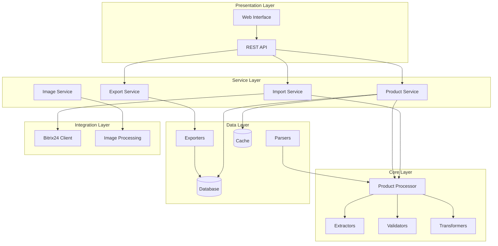
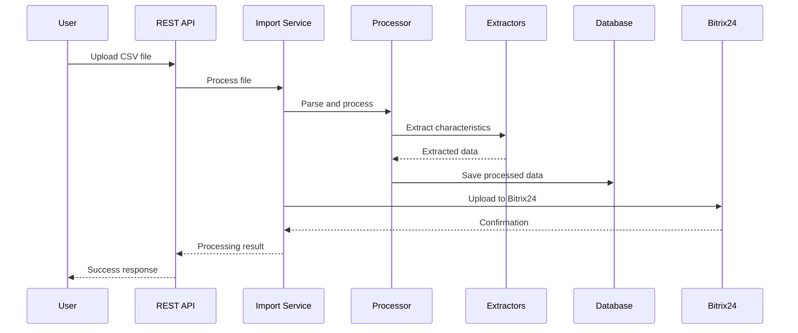
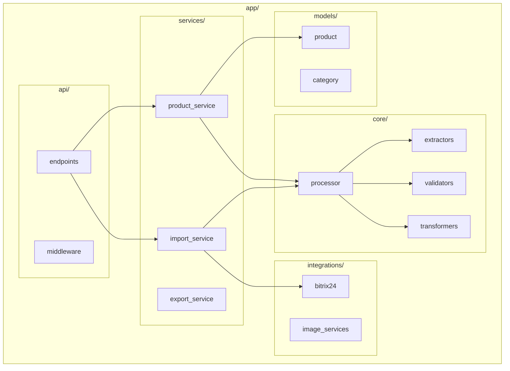

# Дорожная карта реализации новой архитектуры

## 🗓️ Общий план реализации (8-10 недель)

### 📅 Фаза 1: Рефакторинг и базовая структура (3 недели)

#### Неделя 1: Подготовка инфраструктуры
- [ ] Создание новой структуры каталогов
- [ ] Настройка системы управления зависимостями (Poetry/pip-tools)
- [ ] Настройка системы логирования
- [ ] Создание базовых моделей данных
- [ ] Настройка среды разработки (pre-commit, linting)

#### Неделя 2: Миграция парсинга
- [ ] Создание базового интерфейса `BaseParser`
- [ ] Реализация `CSVParser` на основе существующего кода
- [ ] Тестирование совместимости с текущими данными
- [ ] Создание фабрики парсеров

#### Неделя 3: Извлечение характеристик
- [ ] Разделение методов извлечения на отдельные классы
- [ ] Реализация экстракторов: мощность, световой поток, цветовая температура
- [ ] Создание системы валидации данных
- [ ] Тестирование точности извлечения

### 📅 Фаза 2: Сервисы и API (3 недели)

#### Неделя 4: Основные сервисы
- [ ] Реализация `ProductService`
- [ ] Создание `ImportService` с поддержкой асинхронной обработки
- [ ] Настройка системы кэширования (Redis)
- [ ] Реализация репозиториев для работы с данными

#### Неделя 5: REST API
- [ ] Создание FastAPI приложения
- [ ] Реализация эндпоинтов для импорта/экспорта
- [ ] Добавление middleware для логирования и обработки ошибок
- [ ] Создание OpenAPI документации

#### Неделя 6: Тестирование API
- [ ] Написание unit тестов для всех сервисов
- [ ] Интеграционные тесты для API
- [ ] Настройка CI/CD pipeline
- [ ] Performance тестирование

### 📅 Фаза 3: Интеграции и UI (3 недели)

#### Неделя 7: Интеграция с Битрикс24
- [ ] Реализация клиента для API Битрикс24
- [ ] Создание маппера данных между внутренним форматом и Битрикс24
- [ ] Реализация загрузки товаров и изображений
- [ ] Тестирование интеграции

#### Неделя 8: Веб-интерфейс
- [ ] Создание базового веб-интерфейса (React или простые HTML шаблоны)
- [ ] Страницы: загрузка файлов, просмотр результатов, настройки
- [ ] Интеграция с API через AJAX/fetch
- [ ] Адаптивный дизайн

#### Неделя 9: Обработка изображений
- [ ] Реализация загрузки изображений из URL
- [ ] Обработка и оптимизация изображений
- [ ] Интеграция с облачными хранилищами (опционально)
- [ ] Автоматическое связывание изображений с товарами

### 📅 Фаза 4: Оптимизация и документация (1-2 недели)

#### Неделя 10: Финализация
- [ ] Оптимизация производительности
- [ ] Создание системы мониторинга
- [ ] Полная документация пользователя
- [ ] Подготовка к production развертыванию

## 🎯 Критерии готовности каждой фазы

### Фаза 1: Критерии готовности
- ✅ Все существующие функции работают через новую архитектуру
- ✅ Время обработки не увеличилось более чем на 10%
- ✅ Покрытие тестами основных компонентов > 80%
- ✅ Нет регрессий в качестве обработки данных

### Фаза 2: Критерии готовности
- ✅ API полностью функционален и протестирован
- ✅ Производительность API > 100 запросов/сек
- ✅ Документация API актуальна и полна
- ✅ Система мониторинга настроена

### Фаза 3: Критерии готовности
- ✅ Успешная интеграция с Битрикс24
- ✅ Веб-интерфейс функционален и удобен
- ✅ Обработка изображений работает корректно
- ✅ End-to-end тесты проходят

### Фаза 4: Критерии готовности
- ✅ Система готова к production использованию
- ✅ Документация полна и актуальна
- ✅ Мониторинг и алерты настроены
- ✅ Процедуры backup/restore готовы

## 🛠️ Технические задачи по приоритетам

### Высокий приоритет (Must Have)
1. **Сохранение функциональности**: Вся текущая логика должна работать
2. **Обратная совместимость**: Поддержка существующих форматов данных
3. **Производительность**: Время обработки не должно ухудшиться
4. **Надежность**: Улучшенная обработка ошибок

### Средний приоритет (Should Have)
1. **API интерфейс**: REST API для интеграций
2. **Веб-интерфейс**: Базовый UI для управления
3. **Конфигурируемость**: Настройка через файлы конфигурации
4. **Логирование**: Подробные логи для отладки

### Низкий приоритет (Could Have)
1. **Интеграция с Битрикс24**: Автоматическая загрузка
2. **Обработка изображений**: Автоматическая загрузка и обработка
3. **Расширенный мониторинг**: Метрики и dashboards
4. **Дополнительные форматы**: Поддержка Excel, XML

## 🔄 Стратегия миграции

### Параллельная разработка


### Поэтапное внедрение
1. **Теневое тестирование**: Новая система работает параллельно, результаты сравниваются
2. **Частичное переключение**: 10% трафика на новую систему
3. **Постепенное увеличение**: 25% → 50% → 100%
4. **Откат при проблемах**: Возможность быстрого возврата к старой системе

## 📊 Архитектурные диаграммы

### Диаграмма компонентов системы


### Диаграмма потока данных


### Диаграмма модулей


## 🔧 Настройка среды разработки

### Необходимые инструменты
```bash
# Основные зависимости
pip install fastapi uvicorn sqlalchemy redis pandas

# Инструменты разработки  
pip install pytest black flake8 mypy pre-commit

# Дополнительные библиотеки
pip install pillow requests aiohttp pydantic
```

### Git hooks
```yaml
# .pre-commit-config.yaml
repos:
  - repo: https://github.com/psf/black
    rev: 22.3.0
    hooks:
      - id: black
  - repo: https://github.com/pycqa/flake8
    rev: 4.0.1
    hooks:
      - id: flake8
  - repo: https://github.com/pre-commit/mirrors-mypy
    rev: v0.942
    hooks:
      - id: mypy
```

## 📈 Метрики успеха

### Технические метрики
- **Производительность**: Обработка 10,000 товаров за < 30 минут
- **Надежность**: 99.9% успешных операций
- **Покрытие тестами**: > 85%
- **Time to Market**: Новые функции за < 2 недели

### Бизнес метрики
- **Экономия времени**: 70% сокращение времени обработки
- **Качество данных**: 95% корректно извлеченных характеристик
- **Пользовательский опыт**: Оценка удобства > 4.5/5
- **Масштабируемость**: Поддержка 100,000+ товаров

---
*Дорожная карта создана: 2025-08-20*
*Статус: Готова к реализации*
*Версия: 1.0*